# FRA503-HW2: Stabilizing CartPole

## Table of Contents
- [FRA503-HW2: Stabilizing CartPole](#fra503-hw2-stabilizing-cartpole)
  - [Table of Contents](#table-of-contents)
  - [Overview](#overview)
  - [Objective](#objective)
  - [1. Which algorithm performs best?](#1-which-algorithm-performs-best)
    - [1.1 Test all algorithm](#11-test-all-algorithm)
      - [Assumption](#assumption)
        - [1. `num_of_action (int)`](#1-num_of_action-int)
        - [2. `action_range (list)`](#2-action_range-list)
        - [3. `discretize_state_weight (list)`](#3-discretize_state_weight-list)
        - [4. `learning_rate (float)`](#4-learning_rate-float)
        - [5. `n_episodes (int)`](#5-n_episodes-int)
        - [6. `start_epsilon (float)`](#6-start_epsilon-float)
        - [7. `epsilon_decay (float)`](#7-epsilon_decay-float)
        - [8. `final_epsilon (float)`](#8-final_epsilon-float)
        - [9. `discount (float)` (commonly $\\gamma$)](#9-discount-float-commonly-gamma)
    - [1.2 Result each Algorithm](#12-result-each-algorithm)
    - [1.3 Conclusion](#13-conclusion)
      - [Varidate Stabilize Time](#varidate-stabilize-time)
    - [1.4 How well the agent learns to receive higher rewards](#14-how-well-the-agent-learns-to-receive-higher-rewards)
  - [2. Why does MC (GLIE) perform better than the others?](#2-why-does-mc-glie-perform-better-than-the-others)
    - [2.1 How well the agent with MC performs in the Cart-Pole problem](#21-how-well-the-agent-with-mc-performs-in-the-cart-pole-problem)
      - [Video Cart-Pole Performance by MC (GLIE) Algorithm](#video-cart-pole-performance-by-mc-glie-algorithm)
      - [Reward](#reward)
      - [Stabilize Time (second)](#stabilize-time-second)
      - [Epsilon Decay Characthalistic](#epsilon-decay-characthalistic)
    - [2.2 Result Interpretation: GLIE Monte Carlo](#22-result-interpretation-glie-monte-carlo)
      - [Analysis of Q-Value](#analysis-of-q-value)
      - [Summary](#summary)
  - [3. How do the resolutions of the action space and observation space affect the learning process? Why?](#3-how-do-the-resolutions-of-the-action-space-and-observation-space-affect-the-learning-process-why)
    - [1. Action Space Resolution (num\_of\_action)](#1-action-space-resolution-num_of_action)
      - [Effects on Learning](#effects-on-learning)
    - [2. Observation Space Resolution (discretize\_state\_weight)](#2-observation-space-resolution-discretize_state_weight)
      - [Effects on Learning](#effects-on-learning-1)
  - [Contributor](#contributor)


## Overview
 In this homework, we will work on the Stabilizing Cart-Pole Task, where the goal is to train the agent with learning algorithms (i.e. Q-Learning, Monte-Carlo, Temporal Difference Learning, and Double Q-Learning) to control a cart moving along a frictionless track to keep a pole balanced. The pole starts near an upright position (close to 90° vertical), and the agent must apply the right forces to the cart to prevent it from tipping over. The challenge is to stabilize the system while minimizing unnecessary movement. The episode ends if the pole leans too far or the cart moves too far from the center.

## Objective

You must evaluate the agent's performance in terms of learning efficiency (i.e., how well the agent learns to receive higher rewards) and deployment performance (i.e., how well the agent performs in the Cart-Pole problem). Analyze and visualize the results to determine:

- Which algorithm performs best?
- Why does it perform better than the others?
- How do the resolutions of the action space and observation space affect the learning process? Why?

## 1. Which algorithm performs best?
### 1.1 Test all algorithm
#### Assumption
1. RL-base has the parameters to use at each algorithm but only Monte-Carlo (MC) is not using learning rate in the equation.
   ```python
    # hyperparameters
    num_of_action = 19
    action_range = [-15, 15]  # [min, max]
    discretize_state_weight = [5, 5, 2, 2]  # [pose_cart:int, pose_pole:int, vel_cart:int, vel_pole:int]
    learning_rate = 0.1
    n_episodes = 10000
    start_epsilon = 1.0
    epsilon_decay = 0.9995  # reduce the exploration over time
    final_epsilon = 0.01
    discount = 0.99
   ```

##### 1. `num_of_action (int)`

- **Definition**: The number of discrete actions your agent can select at each timestep.  
- **Interpretation**: In a cartpole-like environment, a higher `num_of_action` might capture more fine-grained force commands (e.g., 19 possible forces instead of just left vs. right).

---

##### 2. `action_range (list)`

- **Definition**: A numeric range (e.g., $ [-15, 15] $) mapping discrete action indices to real-valued actions in a continuous action space.   
- **Interpretation**:
    - A **wider** range allows higher forces but can lead to more variance in outcomes.  
    - A **narrower** range might stabilize training but limit maximum performance.

---

##### 3. `discretize_state_weight (list)`

- **Definition**: A list of scaling factors used to **discretize** each dimension of the (continuous) observation vector. For example, in a 4-dimensional state $[x, \dot{x}, \theta, \dot{\theta}] $ (cart position, cart velocity, pole angle, pole angular velocity), you might assign separate discrete “bins” for each.  
- **Interpretation**:  
    - **Higher** weights or more bins produce a **finer** resolution but **larger** Q-tables (slower learning).  
    - **Lower** weights create a **coarser** representation, possibly sacrificing optimal control for faster convergence.

---

##### 4. `learning_rate (float)`

- **Definition**: A factor typically denoted $\alpha$ that controls how quickly your Q-values are updated.  

- **Interpretation**: 
    - A high learning rate means Q-values change rapidly, while a low learning rate may stabilize training but slow convergence.

---

##### 5. `n_episodes (int)`

- **Definition**: The number of episodes the agent will experience (simulate) during training.  
- **Interpretation**: Longer training (more episodes) usually improves policy estimation, but there may be diminishing returns if the environment is fully explored or if hyperparameters are not well tuned.

---

##### 6. `start_epsilon (float)`

- **Definition**: The initial $\epsilon$ value in an **$\epsilon$-greedy** exploration strategy. $\epsilon$ indicates the probability of choosing a random action instead of the greedy (best) action according to the current Q-values.  
- **Interpretation**: Typically set near 1.0 (100% random at the very beginning). The agent then decays $\epsilon$ to gradually shift from exploration to exploitation.

---

##### 7. `epsilon_decay (float)`

- **Definition**: The factor by which $\epsilon$ is multiplied per episode (or per step, depending on your code) to reduce random exploration over time.  
- **Interpretation**:
    - **Decay too fast**: The agent may not explore enough, converging to a suboptimal policy.  
    - **Decay too slow**: The agent wastes opportunities to exploit an improving policy.

---

##### 8. `final_epsilon (float)`

- **Definition**: The minimum $\epsilon$ value. This ensures the agent **always** maintains some level of random exploration, never going fully deterministic.  

---

##### 9. `discount (float)` (commonly $\gamma$\)

- **Definition**: A factor in $[0, 1]$ that discounts future rewards relative to immediate rewards.    
- **Interpretation**:
    - **$\gamma \approx 1.0$**: Long-term rewards strongly influence Q-values. Useful for tasks requiring extended planning.  
    - **$\gamma \ll 1.0$**: The agent cares more about rewards it gets soon, so it focuses less on the future.

---

### 1.2 Result each Algorithm
1. **MC (GLIE)**
   - mean reward
    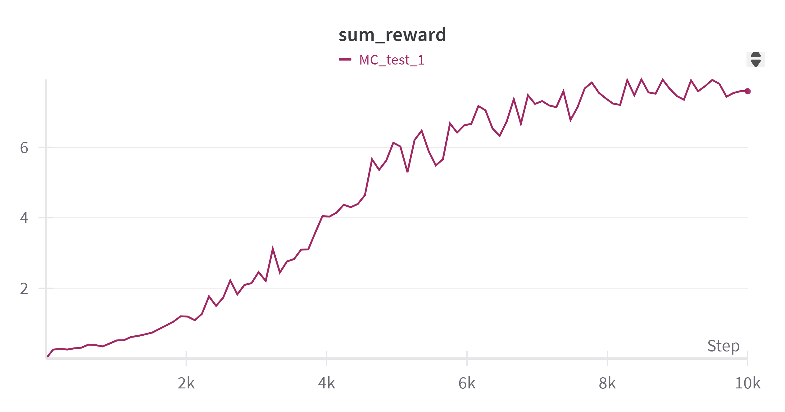
    From image MC has **maximum reward at 7.9**
   - stabilize time before terminate
    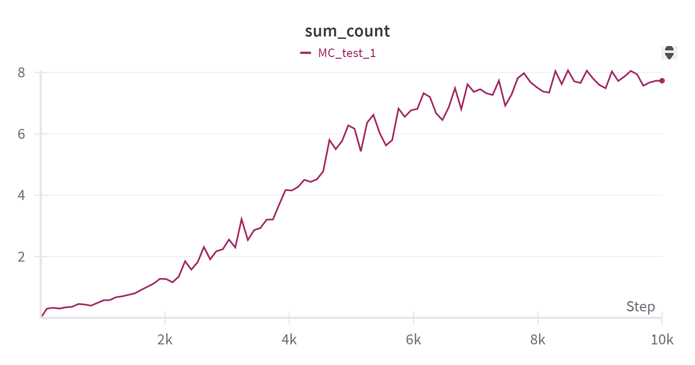
    From image MC has **maximum stabilize time is 8.0 second**
2. **SARSA**
   - mean reward
    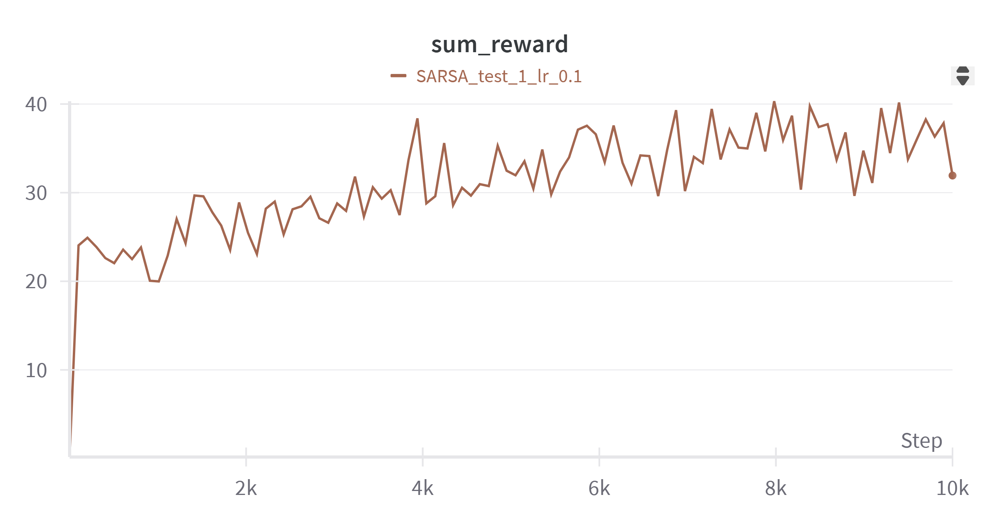
    From image SARSA has **maximum reward at 40.0**
   - count time before terminate
    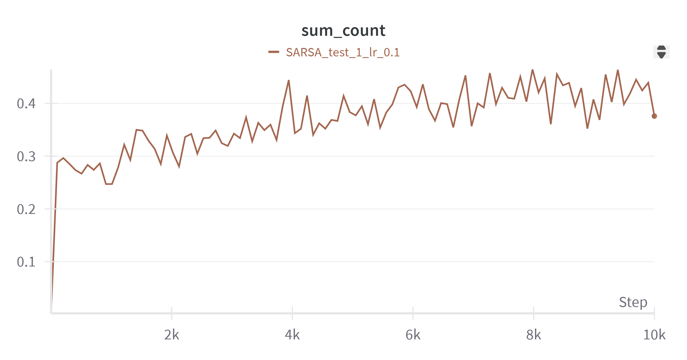
    From image MC has **maximum stabilize time is 0.4 second**
3. **Q-Learning**
   - mean reward
    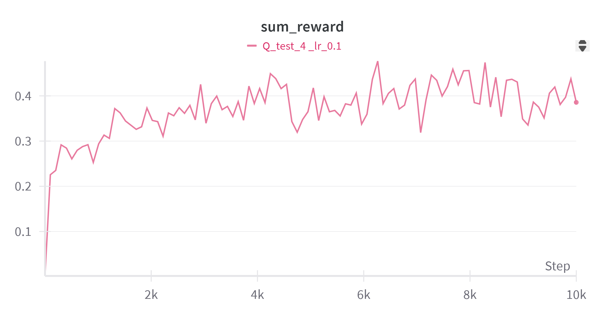
    From image Q-Learning has **maximum reward at 0.47**
   - count time before terminate
    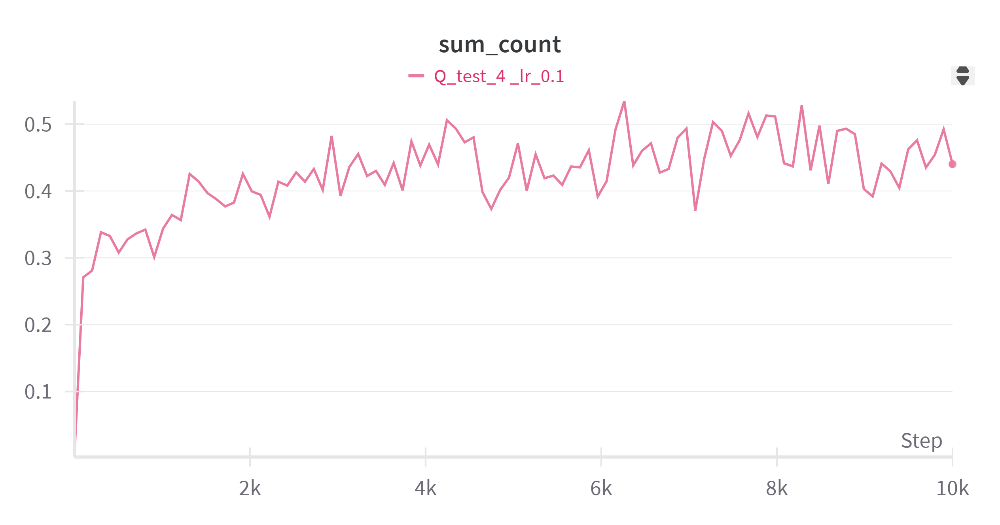
    From image Q-Learning has **maximum stabilize time is 0.53 second**
4. **Double Q-Learning**
   - mean reward
    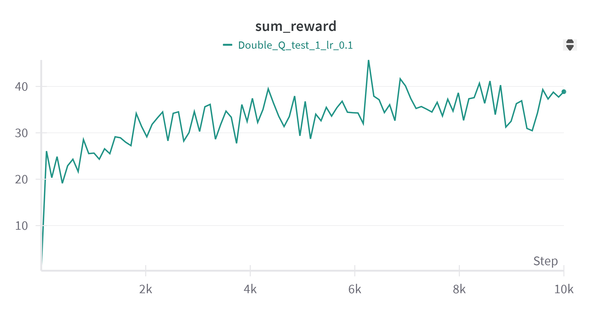
    From image Double Q-Learning has **maximum reward at 45.71**
   - count time before terminate
    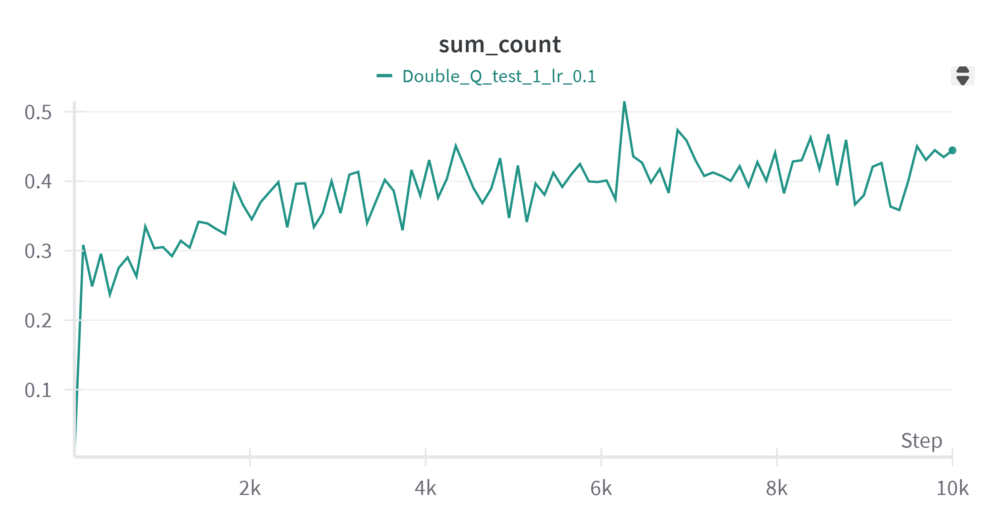
    From image Double Q-Learning has **maximum stabilize time is 0.51 second**

**Note:** All algorithm have same epsilon decay.
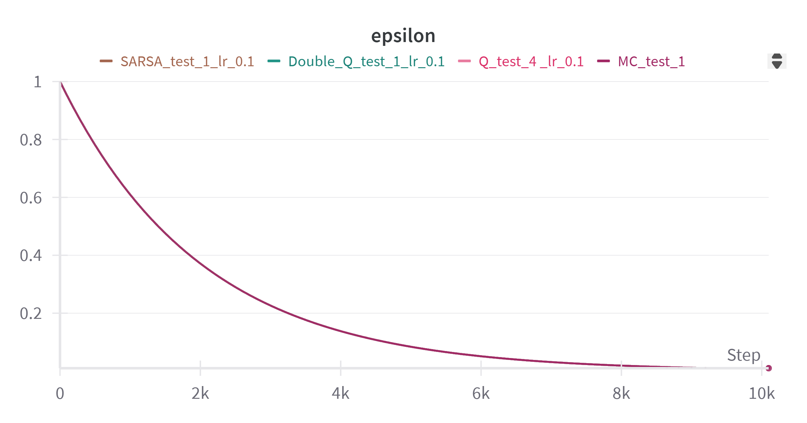

### 1.3 Conclusion
#### Varidate Stabilize Time
- Stabilize Time of **MC**, **SARSA**, **Q-Learning**, **Double Q-Learning**
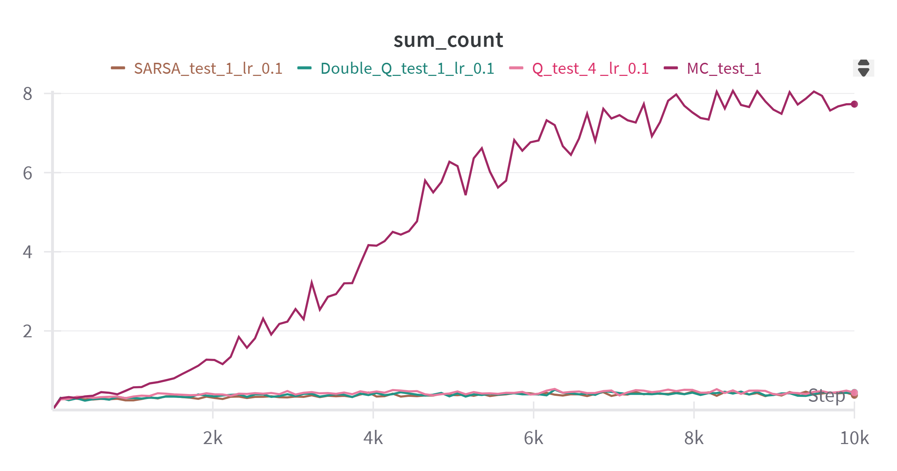
- Stabilize Time of **SARSA**, **Q-Learning**, **Double Q-Learning**
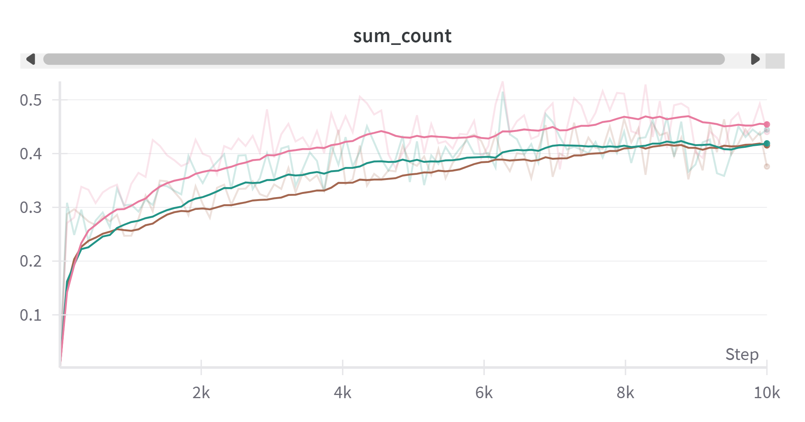

From result of Varidate Stabilize Time. **MC** algorithm can performs bestest, followed by **Q-Learning** -> **Double Q-Learning** -> **SARSA**


### 1.4 How well the agent learns to receive higher rewards

I create experiment to test how parameter effect reward. 

- `epsilon_decay`: adjust in step **0.9995, 0.9997, 0.9999**
  1. **MC (GLIE)**
 
        
        
        
    - Red  = 0.9995
    - Blue = 0.9997
    - Grey = 0.9999
    
    **Result**
    - From image if epsilon_decay high agent will explore longer and go to exploit slower. It make reward not increase fast and cart pole can not stabilize longer but if increase n_episodes more it will get reward higher and stabilize longer than epsilon_decay low.

- `discount`: adjust in step **0.99 (Red), 0.90 (Blue)**

  1. **MC (GLIE)**

        
        

        Effect of High `discount` (Red)
        - Helps MC find long-term optimal policies
        - Makes updates more unstable because full-episode rewards can vary a lot
        - Takes longer training to found a good (or best) way to stabilize

        Effect of Low `discount` (Blue)
        - Learns faster because rewards are more immediate
        - May ignore long-term strategies, leading to a **suboptimal policy** 

        > [!NOTE]
        > **suboptimal policy** is a strategy that works but is **not the best one** for example, Keeps the pole up for a while but shake a lot or falls too soon because it didn't learn the best moves.

        **Cart-Pole case**: High `discount` is good because stabilization is a long-term goal.

  2. **SARSA**

        
        

        Effect of High `discount` (Red)
        - Makes SARSA safer and more stable
        - Learns too careful and slower
        - Might not explore enough

        Effect of Low `discount` (Blue)
        - Learns faster, but favors short-term rewards
        - Less stable and more greedy

        **Cart-Pole case**: Low `discount` makes SARSA even weaker because it already learns too careful and slower.

  3. **Q-Learning**

        
        

        Effect of High `discount` (Red)
        - Finds better policies (if enough training is given)
        - Overestimates Q-values, leading to unstable learning

        Effect of Low `discount` (Blue)
        - Learns faster but might settle for a suboptimal policy
        - Becomes more greedy, want to find short-term gains

        **Cart-Pole case**: High `discount` is preferred, but too high may cause unstable learning.

  4. **Double Q-Learning**

        

        Effect of High `discount` (Red)
        - More stable than Q-Learning (less overestimation)
        - Slower to learn

        Effect of Low `discount` (Blue)
        - Learns faster but risks ignoring long-term stability
        - Might not take the best actions

        **Cart-Pole case**: Double Q is already slower than Q-Learning, so high `discount` makes it even slower.

    **Conclusion**
    - High `discount` takes longer to learn and more stable.
    - Low  `discount` learns faster but might be unstable and not work well in the long run.

- `learning_rate`: adjust in step **0.1, 0.5, 5.0**
  1. **SARSA**
     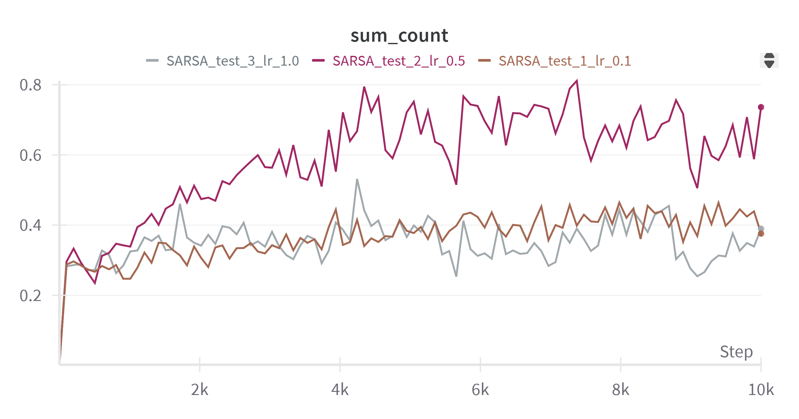
      From image, learning_rate higher it will fast learning but if too high cart pole will response too quickly and lead to terminated
  2. **Q-Learning**
     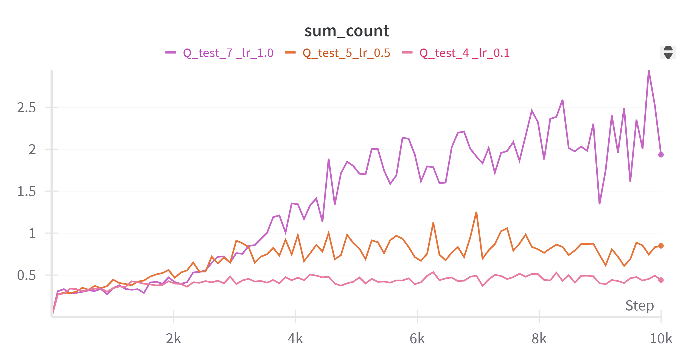
      From image, learning_rate higher it will fast learning and can stabilize longer.
  3. **Double Q-Learning**
      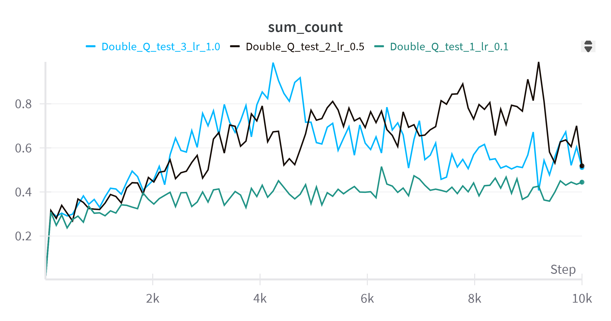
      From image, If learning_rate is too high cart pole will oscilate and performance down.

---
## 2. Why does MC (GLIE) perform better than the others?
- **Full-episode updates improve long-term stability**

  - Monte Carlo (MC) learns from complete episodes, meaning it fully evaluates how good an action is based on the final outcome.

  - Since the Cart-Pole problem is episodic, MC has an advantage because it considers the entire trajectory rather than just short-term rewards.

- **GLIE ensures full exploration**

  - GLIE (Greedy in the Limit with Infinite Exploration) ensures the agent tries all actions enough times before converging.

  - This prevents premature convergence to suboptimal policies, making MC learn a more globally optimal policy.

- **No bootstrapping → Less bias, but higher variance**

  - MC does not use bootstrapping (i.e., it does not estimate future rewards based on other Q-values like Q-learning and SARSA).

  - This means MC avoids issues with value overestimation, leading to a better long-term strategy.

- **Cart-Pole favors long-term planning**

  - Since stabilizing the pole for longer episodes is the goal, MC benefits from its ability to estimate long-term returns.

  - Temporal Difference (TD) methods like Q-Learning and SARSA update based on short-term values, which can lead to short-sighted strategies.

### 2.1 How well the agent with MC performs in the Cart-Pole problem

#### Video Cart-Pole Performance by MC (GLIE) Algorithm
https://github.com/user-attachments/assets/62547fe1-0078-4575-9dda-99a653dcdc00

#### Reward

#### Stabilize Time (second)

#### Epsilon Decay Characthalistic
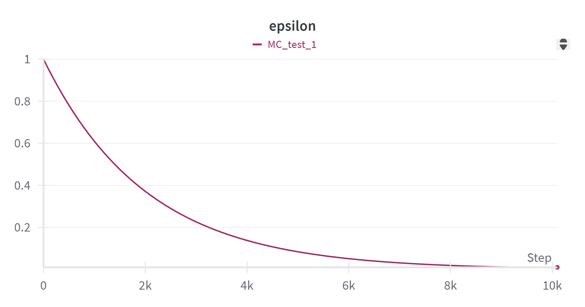

From the sum_reward graph, you can see that the reward value increases continuously until it reaches 8,000 episodes, then it starts to not increase more because agent stop to explore and only exploit action that it think is the best at the time. 

You can see in sum_count graph that Cart-Pole can maintain stabilize for up to around 8 seconds.

### 2.2 Result Interpretation: GLIE Monte Carlo
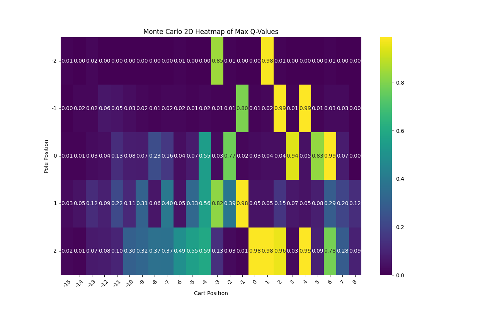
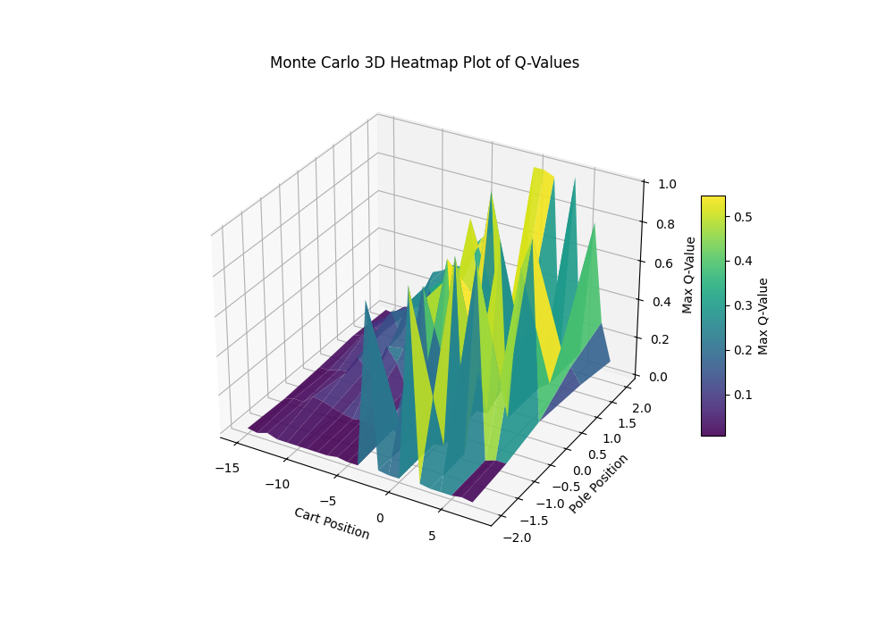

From these figures, each grid cell (in the 2D heatmap) or point on the surface (in the 3D plot) corresponds to a discretized 
(cart position , pole angle) state in the CartPole environment. The color scale (ranging from deep purple to bright yellow) and the vertical axis in the 3D plot represent the learned maximum action‐value 
𝑄( 𝑠, 𝑎 ) for that state, as estimated by Monte Carlo (MC) algorithm with GLIE exploration. Higher (yellow) values of 𝑄 means states from which the agent expects to achieve greater long‐term returns (more time balancing the pole without termination).


#### Analysis of Q-Value 


- High Q in Near‐Balanced States:

    States in which the cart is near the center (around  $x \approx 0$ ) and the pole angle is near upright ($\theta \approx 0 $) show consistently large Q-values (0.8 to 1.0 in heatmap). This reflects **the agent’s learned expectation** that maintaining and adjustment the pole close to vertical and the cart near the origin leads to higher cumulative reward before termination.

- Low Q in Extreme States

    Once the pole deviates significantly from the vertical ( $\theta \approx \pm  2$ radians ) or the cart moves too far to the sides ( $x \approx \pm 10$ to  $\pm 15 $ ), the Q-values become small (dark purple). These regions correspond to near-terminal or unrecoverable conditions (can't be stabilized) in CartPole, where the environment will end quickly, leading to a low return 

- Smoothness vs. Sharp Peaks

    The 3D surface plot shows that most states have medium Q-values, but some states stand out with high "peaks" in value. These peaks represent very good states for the agent. This pattern  methods update Q-values using the total rewards from full episodes. As a result, states that often lead to successful balancing tend to have higher Q-values over time.


#### Summary

These plots clearly show that the GLIE Monte Carlo agent has learned to favor states where the cart stays near the center and the pole remains upright. In these balanced positions, the agent expects to receive higher cumulative rewards, which is why these areas appear as bright yellow or tall peaks on the Q-value plots. In contrast, when the agent is in states where the cart or pole is far from this equilibrium, it anticipates the episode will end soon and gives those states a low value represented by dark purple regions.

## 3. How do the resolutions of the action space and observation space affect the learning process? Why?

### 1. Action Space Resolution (num_of_action)
```python
num_of_action = 19
action_range = [-15, 15]  # [min, max]
```
- My discrete action space has 19 actions, mapped to the continuous range [-15, 15].

- The function `mapping_action()` scales a discrete action index (0 to 18) to a continuous force.

#### Effects on Learning
- **Higher action resolution (more actions, finer control)**

  ✅ More precise control over the force applied to the cart.

  ❌ Harder to learn, slower convergence

- **Low resolution**

  ✅ Simpler learning, faster convergence

  ❌ Limited control, might miss fine-tuned actions

🔍 If reduce `num_of_action`?

- Example: If `num_of_action = 5`, the agent can only choose a few forces (e.g., -15, -7.5, 0, 7.5, 15).

- This makes learning faster but limits precision. Agent might overcorrect and fail to stabilize.

### 2. Observation Space Resolution (discretize_state_weight)
```python
discretize_state_weight = [5, 5, 2, 2]  # [pose_cart, pose_pole, vel_cart, vel_pole]
```
- This scales convert **continuous** into **discrete** states.

- Function `discretize_state()` multiplies state values by these weights and rounds them.

#### Effects on Learning
- **Higher resolution (larger weights, more distinct states)**

  ✅ The agent understands fine differences in pole angle, cart position, and velocity.

  ❌ More states = More Q-values = More time to explore all possibilities. It make agent slow learning.

- **Low resolution**

  ✅ Faster learning, fewer states to explore

  ❌ May lose important details → leads to suboptimal policy

🔍 If change `discretize_state_weight`?

- If set `discretize_state_weight = [10, 10, 5, 5]`, it will get even finer discretization → better policies but much slower learning.

- If set `discretize_state_weight = [2, 2, 1, 1]`, it will get coarser discretization → faster learning but might fail to stabilize in edge cases.

## Contributor
1. Natthaphat Sookpanya 65340500023
2. Karanyaphas Chitsuebsai 65340500065